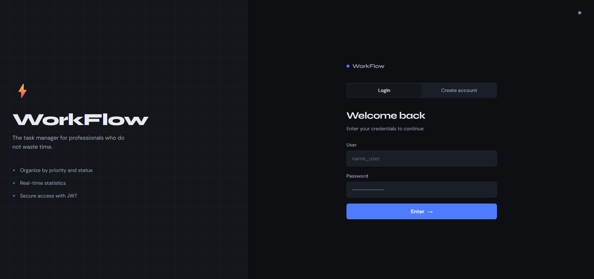
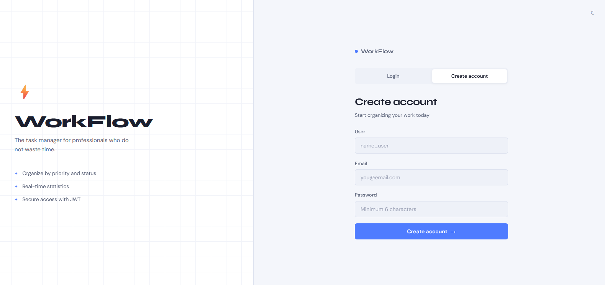
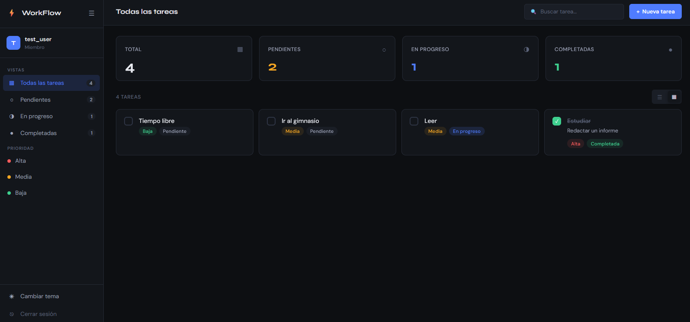
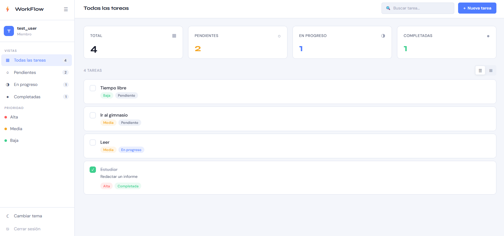
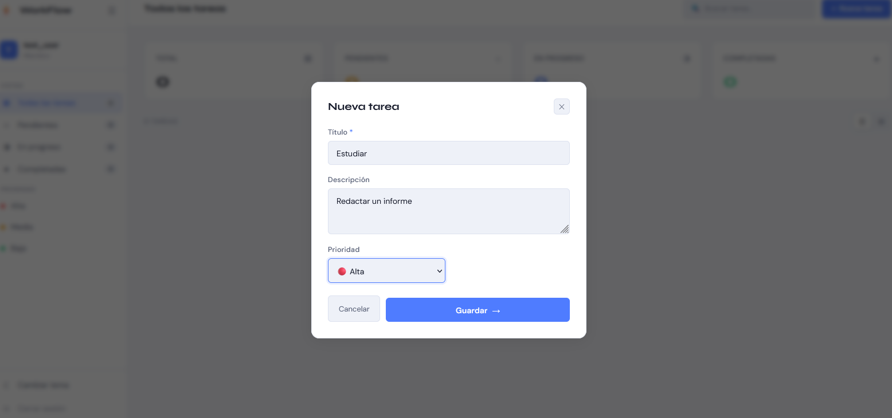

<div align="center">

# ⚡ WorkFlow
### Full Stack Task Manager


A modern, full-stack personal task manager built with FastAPI and Vanilla JS. Features JWT authentication, real-time filtering, priority management, and a professional dark/light theme.

[Report Bug](https://github.com/vddeseifecastro/workflow-task-manager/issues) · [Request Feature](https://github.com/vddeseifecastro/workflow-task-manager/issues)

</div>

---

## 📸 Screenshots

### 🔐 Login



### 📝 Create Account



### 📋 Dashboard — Dark Theme



### ☀️ Dashboard — Light Theme



### ➕ New Task



---

## ✨ Features

### 🧑‍💻 Usuario
- Registro e inicio de sesión con contraseñas encriptadas (bcrypt)
- Autenticación JWT — sesión de 24 horas, persistida en localStorage
- Dashboard con estadísticas en tiempo real (total, pendientes, en progreso, completadas)
- Crear, editar y eliminar tareas
- Marcar tareas como completadas con un clic
- Filtrar por estado (pendiente, en progreso, completada)
- Filtrar por prioridad (alta, media, baja)
- Búsqueda en tiempo real por título
- Vista lista y vista grid
- Sidebar colapsable con navegación rápida
- Tema oscuro / tema claro persistido en localStorage
- Diseño completamente responsive (móvil y escritorio)

### ⚙️ Backend
- API REST completa documentada con Swagger (`/docs`)
- Autenticación OAuth2 con tokens JWT
- Contraseñas hasheadas con bcrypt — nunca se almacenan en texto plano
- Aislamiento de datos por usuario — cada usuario solo accede a sus tareas
- Validación con Pydantic en todos los endpoints
- CORS configurado para desarrollo local

---

## 🖥️ Tech Stack

| Capa | Tecnología |
|------|-----------|
| Backend | FastAPI 0.129, SQLAlchemy 2.0, Pydantic 2.12, Python 3.12 |
| Autenticación | JWT (python-jose 3.5), bcrypt (passlib 1.7.4) |
| Base de datos | SQLite |
| Frontend | Vanilla JS (ES6+), HTML5, CSS3 |
| Fuentes | Syne + DM Sans (Google Fonts) |
| Dev Server | Uvicorn 0.41 |

---

## 🚀 Getting Started

### Prerrequisitos
- Python 3.12+
- Navegador moderno (Chrome, Firefox, Edge)

### Backend Setup

```bash
cd backend
```
```bash
python -m venv venv
venv\Scripts\activate        # Windows
# source venv/bin/activate   # Mac / Linux
```
```bash
pip install -r requirements.txt
```

Crea un archivo `.env` dentro de `/backend` (usa `.env.example` como plantilla):
```env
SECRET_KEY=tu_clave_secreta_muy_larga_aqui
ALGORITHM=HS256
ACCESS_TOKEN_EXPIRE_MINUTES=1440
```

> ⚠️ **Importante:** Genera tu propia `SECRET_KEY` con este comando:
> ```bash
> python -c "import secrets; print(secrets.token_hex(32))"
> ```

Arranca el servidor:
```bash
uvicorn app.main:app --reload
```

Backend corriendo en `http://localhost:8000`  
Documentación interactiva en `http://localhost:8000/docs`

### Frontend Setup

No se necesita instalación. Abre directamente en el navegador:

```
frontend/login.html
```

O usa la extensión **Live Server** de VS Code (clic derecho → Open with Live Server).

> **Nota:** El frontend se comunica con el backend en `http://127.0.0.1:8000`. Asegúrate de que el servidor esté corriendo antes de abrir el frontend.

---

## 📁 Project Structure

```
workflow-task-manager/
│
├── backend/
│   ├── app/
│   │   ├── __init__.py
│   │   ├── main.py          ← FastAPI app + CORS + routers
│   │   ├── database.py      ← SQLAlchemy engine + sesión
│   │   ├── models.py        ← Modelos User y Task
│   │   ├── schemas.py       ← Validación Pydantic
│   │   ├── auth.py          ← JWT + bcrypt + OAuth2
│   │   └── routers/
│   │       ├── __init__.py
│   │       ├── users.py     ← /users/register, /users/login, /users/me
│   │       └── tasks.py     ← CRUD completo de tareas
│   ├── .env.example         ← Plantilla de variables de entorno
│   └── requirements.txt     ← Dependencias Python
│
├── frontend/
│   ├── login.html           ← Página de autenticación
│   ├── index.html           ← Dashboard principal
│   ├── css/
│   │   └── style.css        ← Diseño completo + temas dark/light
│   └── js/
│       ├── auth.js          ← Login, registro, manejo de token
│       └── tasks.js         ← CRUD de tareas, filtros, búsqueda, vistas
│
├── screenshots/
│   ├── login.png
│   ├── create_account.png
│   ├── dashboard_dark.png
│   ├── dashboard_white.png
│   └── new_task.png
│
├── .gitignore
└── README.md
```

---

## 🔐 Security

- Las contraseñas **nunca se almacenan en texto plano** — se hashean con bcrypt antes de guardarlas
- Los tokens JWT se firman con una `SECRET_KEY` privada leída desde variables de entorno (`.env`)
- Cada endpoint de tareas verifica que la tarea pertenezca al usuario autenticado — no hay acceso cruzado entre usuarios
- El archivo `.env` y la base de datos `.db` están en el `.gitignore` y nunca se suben al repositorio

---

## 🔄 API Endpoints

| Método | Endpoint | Descripción | Auth |
|--------|----------|-------------|------|
| POST | `/users/register` | Registro de nuevo usuario | ❌ |
| POST | `/users/login` | Login, devuelve JWT | ❌ |
| GET | `/users/me` | Perfil del usuario actual | ✅ |
| POST | `/tasks/` | Crear nueva tarea | ✅ |
| GET | `/tasks/` | Listar tareas (con filtros opcionales) | ✅ |
| GET | `/tasks/{id}` | Obtener tarea por ID | ✅ |
| PUT | `/tasks/{id}` | Actualizar tarea | ✅ |
| DELETE | `/tasks/{id}` | Eliminar tarea | ✅ |

---

## 🌱 Upcoming Features

- [ ] Deploy en Render (backend) + GitHub Pages (frontend)
- [ ] Drag & drop para reordenar tareas
- [ ] Fecha límite por tarea con alertas
- [ ] Etiquetas / categorías personalizadas
- [ ] Exportar tareas a CSV

---

## 👨‍💻 Author

**Victor Dominic Deseife Castro**

[](https://github.com/vddeseifecastro)

---

<div align="center">
  <p>Built with ❤️ by Victor Dominic Deseife Castro</p>
  <p>⭐ Star this repo if you found it useful!</p>
</div>